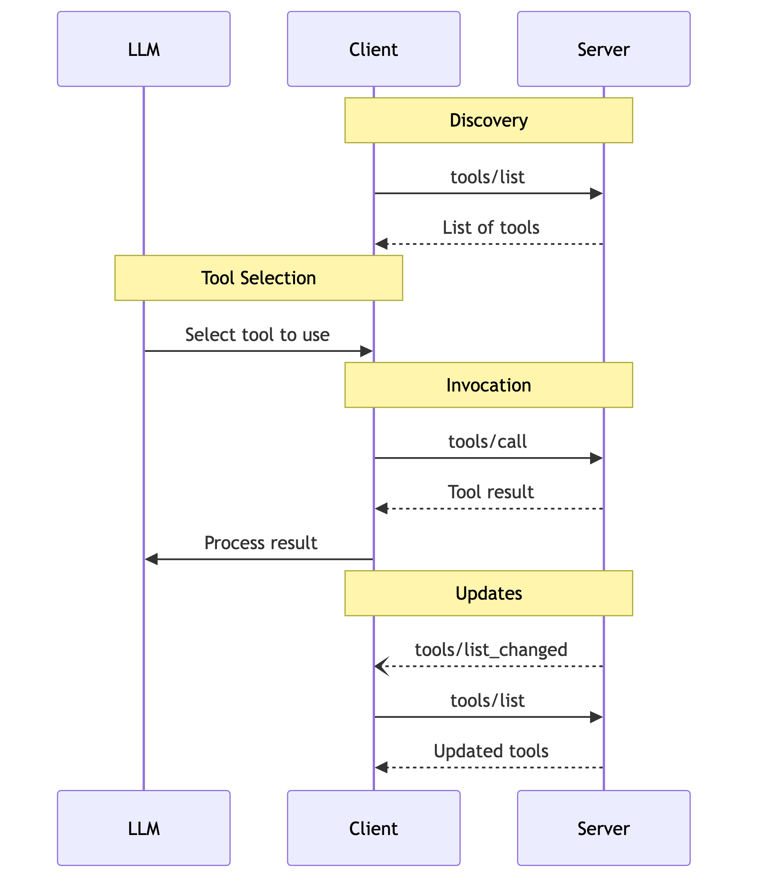

# Module 5 — MCP with Agent Framework

## MCP with Agent Framework
<!-- layout: title -->
<!-- source: https://learn.microsoft.com/en-us/agent-framework/agents/tools/local-mcp-tools?tabs=python -->
<!-- notes: MCP standardizes how an application discovers and invokes tools exposed by a server. Keep the focus on the MAF client boundary, not undocumented wire-level protocol details. -->

- Connect, constrain, approve, and clean up external tools

## MCP Base Protocol
<!-- layout: list -->
<!-- source: https://modelcontextprotocol.io/specification/2025-06-18/basic | https://modelcontextprotocol.io/specification/2025-06-18/basic/lifecycle | https://modelcontextprotocol.io/specification/2025-06-18/basic/transports | https://modelcontextprotocol.io/specification/2025-06-18/basic/authorization -->
<!-- notes: Maps to the spec's "Base Protocol" section and its Utilities sub-pages (ping, cancellation, progress). All implementations MUST support Messages and Lifecycle; Authorization and the individual Utilities are optional. This is the layer MAF's MCP tools sit on top of — worth grounding once so later slides about tool calls make sense in context. -->

- **Messages** — JSON-RPC 2.0 requests, responses, and notifications are the only message shapes the protocol defines
- **Lifecycle** — The `initialize` → `initialized` handshake negotiates protocol version and capabilities before normal operation begins
- **Transports** — stdio (client launches the server as a subprocess) and Streamable HTTP (with optional SSE) are the two standard transports
- **Authorization** — Optional OAuth 2.1-based framework for HTTP transports; stdio implementations use environment credentials instead
- **Utilities** — Ping (liveness check), Cancellation (`notifications/cancelled`), and Progress (`progressToken` updates) support long-running or unreliable connections

## MCP Client Features
<!-- layout: list -->
<!-- source: https://modelcontextprotocol.io/specification/2025-06-18/client/roots | https://modelcontextprotocol.io/specification/2025-06-18/client/sampling | https://modelcontextprotocol.io/specification/2025-06-18/client/elicitation -->
<!-- notes: Maps to the spec's "Client Features" section. These are capabilities a client (the MAF MCP tool, in our case) may optionally offer back to servers — all three require the client to declare the matching capability during initialization, and all three keep a human in the loop by design (the spec is explicit about this for sampling and elicitation). -->

- **Roots** — Servers can query which filesystem/URI boundaries a client exposes, so they know where they're allowed to operate
- **Sampling** — Servers can request an LLM completion through the client, keeping model access, prompt content, and approval under client control
- **Elicitation** — Servers can ask the user for additional structured input mid-interaction, validated against a JSON schema

## MCP Server Features
<!-- layout: list -->
<!-- source: https://modelcontextprotocol.io/specification/2025-06-18/server/tools | https://modelcontextprotocol.io/specification/2025-06-18/server/resources | https://modelcontextprotocol.io/specification/2025-06-18/server/prompts | https://modelcontextprotocol.io/specification/2025-06-18/server/utilities/logging -->
<!-- notes: Maps to the spec's "Server Features" section and its Utilities sub-pages (completion, logging, pagination). Tools is the one this module focuses on end to end; Resources and Prompts are the other two things a server can expose, each with a different user-interaction model (application-driven vs. user-invoked). -->

- **Tools** — Model-callable functions that let an agent perform actions or invoke external systems — the loop covered next
- **Resources** — Context and data (files, schemas, app-specific info) a user or model can bring into the conversation
- **Prompts** — Reusable, user-triggered templates and workflows a server exposes, e.g. as slash commands
- **Utilities** — Completion (argument autocomplete), Logging (structured log levels), and Pagination (cursor-based paging for large list results)

## MCP Tool Message Flow
<!-- layout: image -->
<!-- source: https://modelcontextprotocol.io/specification/2025-06-18/server/tools -->
<!-- notes: This is the MCP specification's own sequence diagram for the tools message flow, reproduced verbatim (not redrawn) from the Tools page at modelcontextprotocol.io. The MAF MCP tool plays the "Client" role. Note this diagram starts at Discovery — the earlier connection-level handshake (capability negotiation) is defined separately on the spec's Lifecycle page and isn't shown here. -->



## Pick the transport that matches the server
<!-- layout: table -->
<!-- source: https://learn.microsoft.com/en-us/agent-framework/agents/tools/local-mcp-tools?tabs=python -->
<!-- notes: These are the three documented Python classes. WebSocket support requires the mcp[ws] optional package. Transport choice follows the server; it is not an application preference you can swap unilaterally. -->

| MAF type | Connection | Use when |
|---|---|---|
| MCPStdioTool | Local child process over stdin/stdout | You launch and trust a local server |
| MCPStreamableHTTPTool | Remote HTTP with streamable responses/SSE | A hosted endpoint exposes MCP over HTTP |
| MCPWebsocketTool | WebSocket | The server explicitly provides a WebSocket endpoint |

## Local stdio is a child-process boundary
<!-- layout: code -->
<!-- source: https://learn.microsoft.com/en-us/agent-framework/agents/tools/local-mcp-tools?tabs=python -->
<!-- notes: Use only commands and packages you have reviewed and pinned. The official pattern uses an async context manager so the local process and connection are closed. -->

```python
async with MCPStdioTool(
    name="calculator",
    command="uvx",
    args=["mcp-server-calculator"],
) as mcp:
    result = await agent.run(
        "Calculate the total.",
        tools=mcp,
    )
```

## DEMO 5.1 — Local stdio MCP tool call, end to end
<!-- layout: demo -->
<!-- demo-time: ~5 min -->
<!-- demo-reference: Runbook: demos/day3/module-5-demo-1-stdio-mcp.md -->
<!-- source: https://learn.microsoft.com/en-us/agent-framework/agents/tools/local-mcp-tools?tabs=python -->
<!-- notes: Placeholder marker slide — the runbook has full narration, setup, and fallback plan. Runs the previous slide's exact MCPStdioTool + mcp-server-calculator pattern live; no matching sample file exists in the repo's 02-agents/mcp folder, so this demo is grounded directly in the Learn doc's own documented code. -->

Run the previous slide's exact code live: connect to a local `mcp-server-calculator` child process, watch the agent discover and invoke a tool through it, and close the connection — client/server loop end to end.

## Remote HTTP belongs behind explicit auth
<!-- layout: code -->
<!-- source: https://learn.microsoft.com/en-us/agent-framework/agents/tools/local-mcp-tools?tabs=python | https://learn.microsoft.com/en-us/python/api/agent-framework-core/agent_framework.mcpstreamablehttptool?view=agent-framework-python-latest -->
<!-- notes: The documented FoundryChatClient sample uses MCPStreamableHTTPTool for a remote endpoint. Do not put tokens in slide code or source control; use a provider that acquires or refreshes credentials. -->

```python
async with MCPStreamableHTTPTool(
    name="docs",
    url="https://learn.microsoft.com/api/mcp",
    allowed_tools=["microsoft_docs_search"],
) as mcp:
    result = await agent.run(
        "Find the current guidance.",
        tools=mcp,
    )
```

## header_provider has two call shapes
<!-- layout: compare -->
<!-- source: https://learn.microsoft.com/en-us/agent-framework/agents/tools/local-mcp-tools?tabs=python -->
<!-- notes: During a tool call, header_provider receives function_invocation_kwargs. Ambient requests such as initialization, discovery, and pings receive an empty dictionary. Therefore connection-time auth cannot depend only on a per-run value. -->

- **Tool-call request**
  - Receives `function_invocation_kwargs`
  - Can derive request-scoped headers
  - Keep secrets outside model-visible arguments
- **Ambient request**
  - Receives `{}`
  - Includes initialization, discovery, and pings
  - Provider must still acquire required connection auth

## Reduce the model's tool surface
<!-- layout: cards -->
<!-- source: https://learn.microsoft.com/en-us/python/api/agent-framework-core/agent_framework.mcpstreamablehttptool?view=agent-framework-python-latest | https://learn.microsoft.com/en-us/agent-framework/agents/tools/controlling-tool-availability?tabs=python -->
<!-- notes: allowed_tools is a documented MCP constructor option. Progressive exposure is a separate experimental Python function-loop feature, not an MCP transport feature. Use it only if you need staged discovery and accept its experimental status. -->

- **allowed_tools** — Expose an explicit MCP allow-list
- **Clear names** — Avoid collisions by selecting or wrapping distinct tool names
- **Progressive exposure — EXPERIMENTAL** — Add tools for the next loop iteration only
- **Reset** — Progressive tool changes re-arm on each new agent run

## approval_mode creates a human boundary
<!-- layout: table -->
<!-- source: https://learn.microsoft.com/en-us/python/api/agent-framework-core/agent_framework.mcpstreamablehttptool?view=agent-framework-python-latest | https://learn.microsoft.com/en-us/agent-framework/agents/tools/tool-approval?tabs=python -->
<!-- notes: approval_mode can require approval for all tools, waive it for all tools, or apply a per-tool mapping on the MCP tool. A run that needs approval returns a user-input request; the application displays the name and arguments and resumes with the decision. -->

| Setting | Effect | Appropriate use |
|---|---|---|
| `always_require` | Every exposed MCP tool needs approval | Unknown or high-risk server |
| `never_require` | Calls proceed without approval | Trusted, low-risk read tools |
| Per-tool mapping | Different rules by tool name | Read automatically; review writes |

## DEMO 5.2 — approval_mode pauses a write tool for review
<!-- layout: demo -->
<!-- demo-time: ~5 min -->
<!-- demo-reference: Runbook: demos/day3/module-5-demo-2-approval-mode.md -->
<!-- source: https://learn.microsoft.com/en-us/python/api/agent-framework-core/agent_framework.mcpstreamablehttptool?view=agent-framework-python-latest | https://github.com/microsoft/agent-framework/blob/main/python/samples/02-agents/tools/function_tool_with_approval.py -->
<!-- notes: Placeholder marker slide — the runbook has full narration, setup, and fallback plan. Adapts the approval pause/resume mechanic from function_tool_with_approval.py onto an MCP tool's approval_mode constructor option; no MCP-specific approval sample exists in the repo yet, so the API reference is the primary grounding source for the MCP-side wiring. -->

Set `approval_mode="always_require"` on the MCP tool and run a request that needs it: the run pauses with a user-input request naming the tool and arguments, and only resumes after an explicit approval decision — the same pause/resume mechanic the official function-tool sample demonstrates, wired onto an MCP tool.

## Security is broader than authentication
<!-- layout: cards -->
<!-- source: https://learn.microsoft.com/en-us/agent-framework/agents/tools/local-mcp-tools?tabs=python -->
<!-- notes: Treat remote tool descriptions, annotations, and results as untrusted input. Review the operator, data sharing, retention, costs, and permissions. Prefer first-party hosted servers over proxies when available. -->

- **Trust** — Review the server operator and package provenance
- **Least privilege** — Narrow identity scopes and allowed_tools
- **Prompt injection** — Treat tool metadata and results as untrusted
- **Audit** — Log selected tool, arguments, approval, result status, and caller

## Local or remote?
<!-- layout: table -->
<!-- source: https://learn.microsoft.com/en-us/agent-framework/agents/tools/local-mcp-tools?tabs=python -->
<!-- notes: Choose remote when a trusted service hosts and updates the endpoint. Choose local when the server is local-only or the client cannot complete remote authentication. Local means you own package and process security. -->

| Question | Prefer local stdio | Prefer remote HTTP |
|---|---|---|
| Who hosts it? | Your process or workstation | Trusted service provider |
| Updates | You pin and manage | Provider manages |
| Authentication | Local environment / server mechanism | Headers or service identity |
| Network | No remote endpoint required | Endpoint must be reachable |
| Operational burden | Higher | Lower |

## Takeaways
<!-- layout: takeaways -->
<!-- source: https://learn.microsoft.com/en-us/agent-framework/agents/tools/local-mcp-tools?tabs=python -->
<!-- notes: Transition to the official Azure DevOps remote server. It is a strong example of remote-first hosting, Entra authentication, server-side filtering, and distinct read/write tools. -->

- You let the server transport determine the MAF MCP class.
- You constrain discovery with an explicit allow-list.
- You design header_provider for both tool-call and ambient requests.
- You require approval for risky operations and inspect arguments.
- You use async context managers to clean up every connection.
