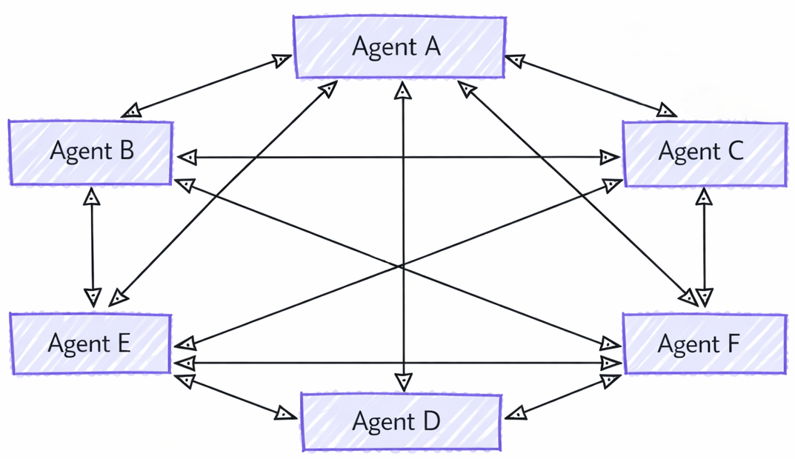
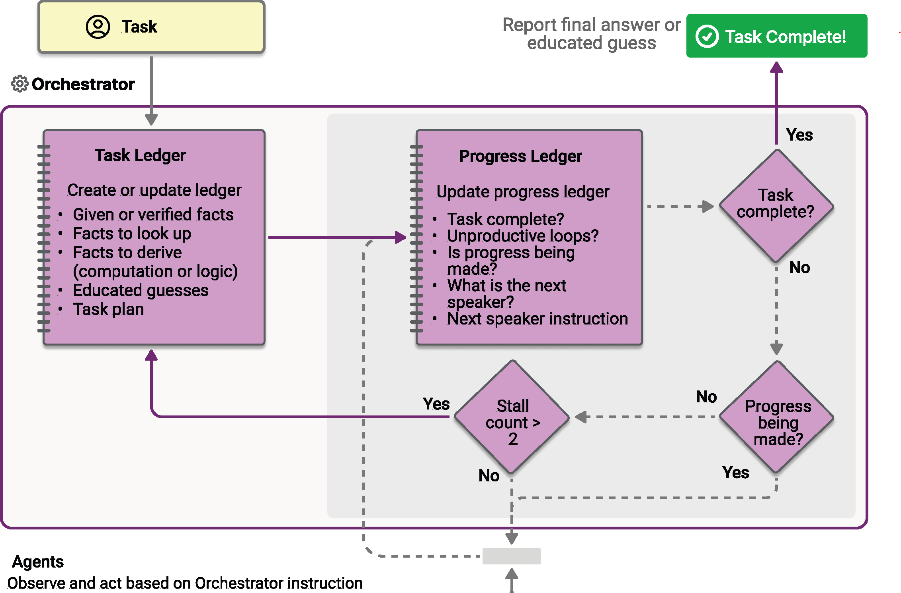

# Module 2 — Orchestration Patterns

## Orchestration Patterns
<!-- layout: title -->
<!-- source: https://learn.microsoft.com/en-us/agent-framework/workflows/orchestrations/ -->
<!-- notes: Five prebuilt workflow templates for common multi-agent coordination scenarios. Each removes the boilerplate of wiring agents together for one well-defined shape. -->

- Five prebuilt templates for coordinating multiple agents — pick the shape that matches your process, or build a custom graph in Module 3

## Five patterns, five shapes
<!-- layout: table -->
<!-- source: https://learn.microsoft.com/agent-framework/journey/workflows -->
<!-- notes: This is the framework's own "when to use it" table from the journey page, reproduced verbatim. Use it as the day's map — the rest of this module walks each row in order. -->

| Pattern | When to use it |
|---|---|
| **Sequential** | Agents execute one after another in a defined order — each builds on the previous agent's output |
| **Concurrent** | Agents execute in parallel — useful when tasks are independent and you want to reduce latency |
| **Handoff** | Agents transfer control to each other based on context — good for routing to specialists |
| **Group Chat** | Agents collaborate in a shared conversation — useful for debate, review, or brainstorming |
| **Magentic** | A manager agent dynamically coordinates specialized agents — balances structure with flexibility |

## Sequential — a pipeline
<!-- layout: list-image -->
<!-- source: https://learn.microsoft.com/en-us/agent-framework/workflows/orchestrations/sequential -->
<!-- notes: Ideal for document review, data pipelines, multi-stage reasoning. By default each agent sees the full prior conversation; chain_only_agent_responses=True narrows that to just the previous agent's response — useful for translation pipelines and progressive refinement. Diagram reproduced verbatim from the official Sequential orchestration Learn page. -->

- Agents run one after another; each builds on the previous agent's output
- By default, each agent consumes the **full prior conversation** (input + every response so far)
- `chain_only_agent_responses=True` narrows this to just the previous agent's response — useful for translation pipelines and progressive refinement
- **Order Matters**: agents execute strictly in the order given — there is no built-in way to route back to an earlier agent


## Sequential in code
<!-- layout: code -->
<!-- source: https://learn.microsoft.com/en-us/agent-framework/workflows/orchestrations/sequential -->
<!-- notes: SequentialBuilder is the simplest orchestration builder — a flat participants list. The terminal output is the last participant's AgentResponse; intermediate_output_from surfaces earlier participants' output too. -->

```python
from agent_framework.orchestrations import SequentialBuilder

workflow = SequentialBuilder(
    participants=[drafter, editor, finalizer]).build()

result = await workflow.run("Write a brief introduction to artificial intelligence.")
```

The terminal output is the **last** participant's response; pass `intermediate_output_from=[...]` to also surface earlier agents' output as observational events.

## Concurrent — parallel perspectives
<!-- layout: list-image -->
<!-- source: https://learn.microsoft.com/en-us/agent-framework/workflows/orchestrations/concurrent -->
<!-- notes: All agents run the same input independently and simultaneously — good for brainstorming, ensemble reasoning, voting. The superstep model (Module 3) is what actually runs them concurrently. Diagram reproduced verbatim from the official Concurrent orchestration Learn page. -->

- Every agent processes the **same input independently**, at the same time
- Well suited to diverse perspectives: brainstorming, ensemble reasoning, voting systems
- The default aggregator returns one `AgentResponse` with one assistant message per participant — no synthesis, just collection
- Override the aggregator when you need domain-specific synthesis of the parallel results


## Concurrent in code
<!-- layout: code -->
<!-- source: https://learn.microsoft.com/en-us/agent-framework/workflows/orchestrations/concurrent -->
<!-- notes: ConcurrentBuilder is as flat as SequentialBuilder — same participants list, different edge topology (fan-out/fan-in) under the hood. -->

```python
from agent_framework.orchestrations import ConcurrentBuilder

workflow = ConcurrentBuilder(participants=[researcher, marketer, legal]).build()

outputs = (await workflow.run("Launch plan for a budget electric bike.")).get_outputs()
for msg in outputs[0].messages:
    print(f"[{msg.author_name}]: {msg.text}")
```

## DEMO 2.1 — ConcurrentBuilder proves it, wall-clock
<!-- layout: demo -->
<!-- demo-time: ~5 min -->
<!-- demo-reference: Runbook: demos/day4/module-2-demo-1-concurrent-parallelism.md -->
<!-- source: https://github.com/microsoft/agent-framework/blob/main/python/samples/03-workflows/orchestrations/concurrent_agents.py -->
<!-- notes: Placeholder marker slide — the runbook has full narration, setup, and fallback plan. Grounded in the official concurrent_agents.py sample (same researcher/marketer/legal agents and eBike prompt), adapted with a timing middleware and a sequential comparison to prove the overlap live instead of asserting it. -->

The previous slide's code prints three agents' responses one after another, which LOOKS sequential on the page. This demo times it for real: a small `AgentMiddleware` timestamps each agent's start/finish under `ConcurrentBuilder` and draws an ASCII overlap timeline, then the SAME three agents run again with plain sequential `await agent.run(...)` calls. Concurrent's total wall-clock lands close to one agent's own time; sequential lands close to the sum of all three — that gap is the proof.

## Handoff — control transfers, not delegation
<!-- layout: compare -->
<!-- source: https://learn.microsoft.com/en-us/agent-framework/workflows/orchestrations/handoff -->
<!-- notes: This is the framework's own contrast, worth dwelling on since Module 1 already covered agents-as-tools — attendees will otherwise conflate the two. Handoff has no central orchestrator; agents connect directly in a mesh so every agent shares context with every other. -->

- **Agents as tools** (Module 1 recap)
  - Outer agent keeps ownership; delegates a subtask
  - Control returns to the outer agent when the inner agent finishes
- **Handoff**
  - The receiving agent takes **full ownership** of the task
  - No central orchestrator — agents connect directly in a mesh topology
  - Good for customer support, expert systems, dynamic routing

## Handoff — a mesh, not a hierarchy
<!-- layout: list-image -->
<!-- source: https://learn.microsoft.com/en-us/agent-framework/workflows/orchestrations/handoff -->
<!-- notes: A dedicated shape slide, separate from the previous compare slide's agents-as-tools contrast — Handoff's mesh topology (every agent connects to every other, no central orchestrator) is easiest to see as a picture rather than another bullet. Diagram reproduced verbatim from the official Handoff orchestration Learn page. -->

- Agents connect directly to each other — a mesh, not a star with a middle orchestrator
- Any agent can hand the conversation fully to another agent it's configured to reach
- Full conversation history travels with the handoff — the receiving agent has complete context
- Interactive by default: control returns to the user whenever an agent responds without handing off



## Handoff in code
<!-- layout: code -->
<!-- source: https://learn.microsoft.com/en-us/agent-framework/workflows/orchestrations/handoff -->
<!-- notes: add_handoff restricts routing (by default every agent can hand off to every other); the mesh topology for context-sharing stays intact regardless — restricting handoff rules only governs who can take over next, not who sees the conversation. Interactive by default: when an agent responds without handing off, control returns to the user for the next input. -->

```python
from agent_framework.orchestrations import HandoffBuilder

workflow = (
    HandoffBuilder(
        name="customer_support",
        participants=[triage_agent, refund_agent, order_agent, return_agent],
    )
    .with_start_agent(triage_agent)
    .add_handoff(triage_agent, [order_agent, return_agent])
    .add_handoff(return_agent, [refund_agent])
    .build()
)
```

Handoff is **interactive by default** — when an agent responds without handing off, control returns to the user for the next input.

## Group Chat — a coordinated conversation
<!-- layout: list-image -->
<!-- source: https://learn.microsoft.com/en-us/agent-framework/workflows/orchestrations/group-chat -->
<!-- notes: Star topology with an orchestrator in the middle — the key contrast with Handoff's mesh, no-orchestrator design. Context Synchronization is worth stating precisely: agents do NOT share one AgentSession instance (different agent types may implement it differently); the orchestrator broadcasts each response so every agent's own session stays in sync before its next turn. Diagram reproduced verbatim from the official Group Chat orchestration Learn page. -->

- Star topology: an **orchestrator** in the middle selects who speaks next (round-robin, prompt-based, or custom logic)
- Agents can review and build on each other's responses across **multiple rounds**
- **Context Synchronization**: agents do NOT share one `AgentSession` instance — the orchestrator broadcasts each response so every agent's own session stays current before its next turn
- Bounded by a maximum round/iteration count


## When to use Group Chat
<!-- layout: compare -->
<!-- source: https://learn.microsoft.com/en-us/agent-framework/workflows/orchestrations/group-chat -->
<!-- notes: This "consider alternatives" list is the framework's own — reproduced verbatim rather than paraphrased, since it's a direct decision aid. -->

- **Good fit**
  - Iterative refinement across multiple rounds
  - Collaborative problem-solving, multi-perspective analysis
  - Writer-reviewer content creation
- **Consider an alternative when**
  - You need strict sequential processing → Sequential
  - Agents should work fully independently → Concurrent
  - You need direct agent-to-agent handoffs → Handoff
  - You need complex dynamic planning → Magentic

## Magentic — a planning manager
<!-- layout: list -->
<!-- source: https://learn.microsoft.com/en-us/agent-framework/workflows/orchestrations/magentic -->
<!-- notes: Same star-topology architecture as Group Chat, but the manager plans and tracks progress rather than just picking a speaker. Based on AutoGen's Magentic-One design. The docs' own caveat about untested generalization is worth stating plainly, not softening. -->

- Same star-topology architecture as Group Chat, with a more powerful, **planning-based manager**
- Based on AutoGen's Magentic-One design; well suited to open-ended tasks where the solution path isn't known in advance
- Framework's own caveat: *"it is untested how well the Magentic orchestration will perform outside of the original Magentic-One design"*
- If your scenario doesn't need complex planning, the docs themselves recommend Group Chat instead

## Magentic — task and progress ledgers
<!-- layout: image -->
<!-- source: https://learn.microsoft.com/en-us/agent-framework/workflows/orchestrations/magentic -->
<!-- notes: Full-width, not paired with bullets — this diagram (task ledger, progress ledger, stall-count decision, replan loop) has far more detail and smaller text than the other four patterns' diagrams, and would be illegible if squeezed into the same narrow list-image column. Reproduced verbatim from the official Magentic orchestration Learn page; note its visual style (flat decision-diamond flowchart) differs from the other four patterns' hand-drawn diagrams — it comes from the Magentic-One design, not the same source illustration set. -->



## Magentic's built-in guardrails
<!-- layout: code -->
<!-- source: https://learn.microsoft.com/en-us/agent-framework/workflows/orchestrations/magentic -->
<!-- notes: This is a genuinely useful bridge into Module 6 — Magentic ships with its own bounded-loop parameters and a stall-detection/replan mechanism, the most concrete built-in example of the guardrails Module 6 discusses generically. -->

```python
from agent_framework.orchestrations import MagenticBuilder

workflow = MagenticBuilder(
    participants=[researcher_agent, coder_agent],
    manager_agent=manager_agent,
    max_round_count=10,
    max_stall_count=3,
    max_reset_count=2,
).build()
```

A progress ledger tracks whether the team is making progress; consecutive non-progressing rounds increment a stall counter, and exceeding `max_stall_count` triggers an automatic reset and replan (up to `max_reset_count` times) — a concrete, built-in instance of the guardrail pattern Module 6 covers generically.

## Strengths, weaknesses, and cost profile
<!-- layout: table -->
<!-- source: https://learn.microsoft.com/en-us/agent-framework/workflows/orchestrations/ | https://learn.microsoft.com/en-us/agent-framework/concepts/workflows/builder-and-execution -->
<!-- notes: This table synthesizes the mechanics from every pattern page above plus the superstep execution model (Module 3) — it is this workshop's own engineering judgment, not a verbatim framework table. Flag that explicitly if asked: cost/latency direction is reasoned from documented behavior (parallel supersteps, full-context broadcasts, bounded rounds), not a quoted benchmark. -->

| Pattern | Predictability | Typical cost driver |
|---|---|---|
| Sequential | High — fixed order every run | Sum of every agent's tokens; grows if full context is chained |
| Concurrent | High — all agents always run | Sum of every agent's tokens, but **latency** is the slowest agent, not the sum |
| Handoff | Low — path depends on the conversation | Scales with how many handoffs actually occur; hard to predict up front |
| Group Chat | Medium — bounded by max rounds | Grows with round count; every round re-broadcasts full context to every agent |
| Magentic | Lowest — planning can replan | Highest and least predictable; planning/replanning adds overhead beyond the specialist agents |

## Takeaways
<!-- layout: takeaways -->
<!-- source: https://learn.microsoft.com/en-us/agent-framework/workflows/orchestrations/ -->
<!-- notes: Ask attendees which pattern the lab's Planner/Retriever/Critic revision loop maps to. The honest answer, per Module 3: none of them directly — Sequential can't loop back, so the lab builds a custom graph. That's the bridge into Module 3. -->

- You pick a pattern by asking who controls the next step and whether the path is fixed or dynamic.
- Sequential and Concurrent are predictable and cheap to reason about; Handoff, Group Chat, and Magentic trade predictability for flexibility.
- Sequential cannot loop back to an earlier agent — that gap is exactly what Module 3's custom workflow graphs are for.
- Magentic's `max_round_count`/`max_stall_count`/`max_reset_count` are a real, shipped example of the guardrails Module 6 covers next.
